# Week 2 - Excercises

## Excercise 1: Modeling JavaScript Objects

### 1.1. **Github Objects**

### **Activity 1.1.1.** Modeling a Repository Entity

Se modelará el siguiente diagrama de clases de una simulación de un repositorio de GitHub.

El diagrama es el siguiente:

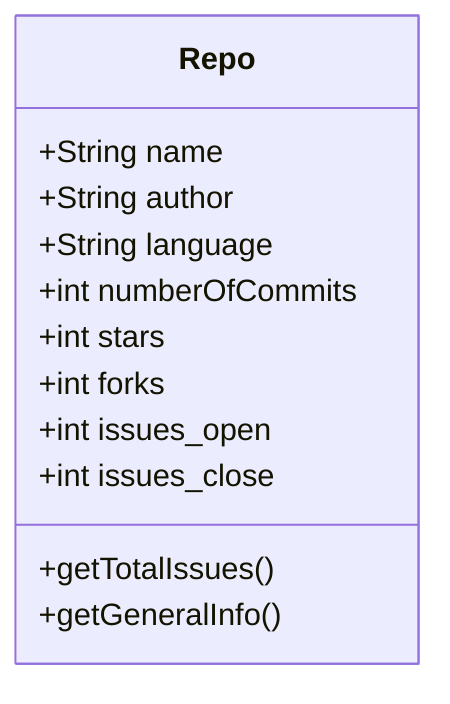

### **Activity 1.1.2.** Modeling a Issue Entity

Se modelará el siguiente diagrama de clases de una Issue de GitHub.

El diagrama es el siguiente:

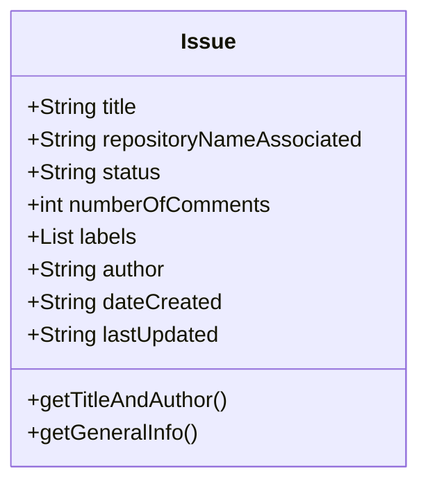

### **Activity 1.1.3.** Modeling a PullRequest Entity

Se modelará el siguiente diagrama de clases de una PullRequest de GitHub.

El diagrama es el siguiente:

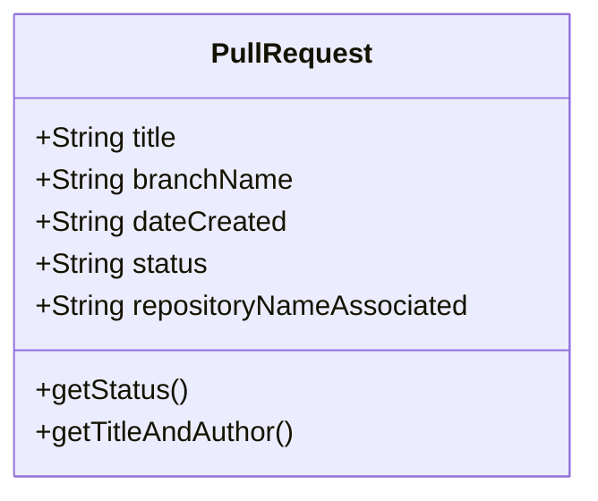

### 1.2. **Twitter Objects**

### **Activity 1.2.1.** Modeling a User Profile Entity

Modelado del siguiente diagrama de clases de un de un perfil de Twitter.

El diagrama es el siguiente:

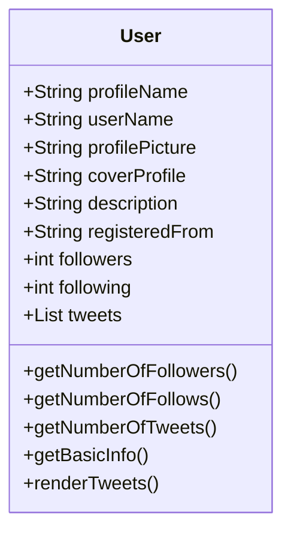

### **Activity 1.2.2.** Modeling a Trending Topic Entity

Modelado del siguiente diagrama de clases de un trending topic de Twitter.

El diagrama es el siguiente:

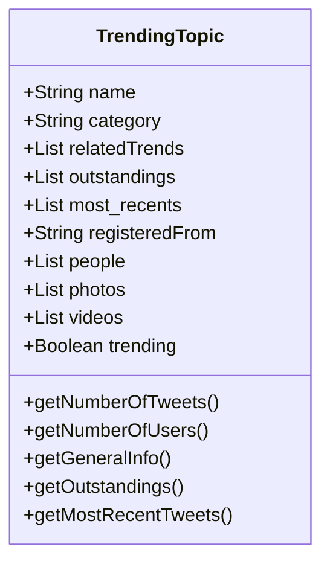

### **Activity 1.2.3.** Modeling a Hashtag Entity

Modelado del siguiente diagrama de clases de un hashtag de Twitter.

El diagrama es el siguiente:

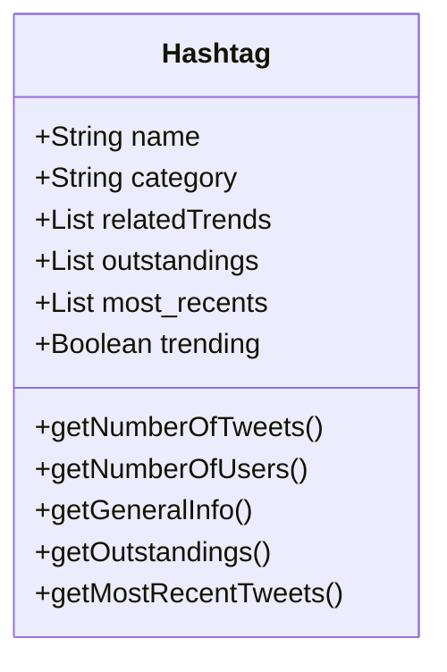

## 1.3 **Facebook Objects**

### **Activity 1.3.1.** Modeling a User Profile Entity

Modelado del siguiente diagrama de clases de un usuario de Facebook.

El diagrama es el siguiente:

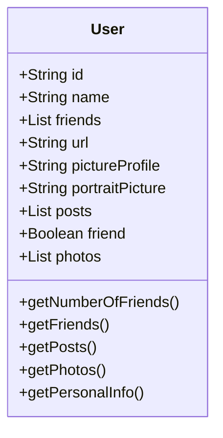

### **Activity 1.3.2.** Modeling a Post Entity

Modelado del siguiente diagrama de clases de un post de Facebook.

El diagrama es el siguiente:

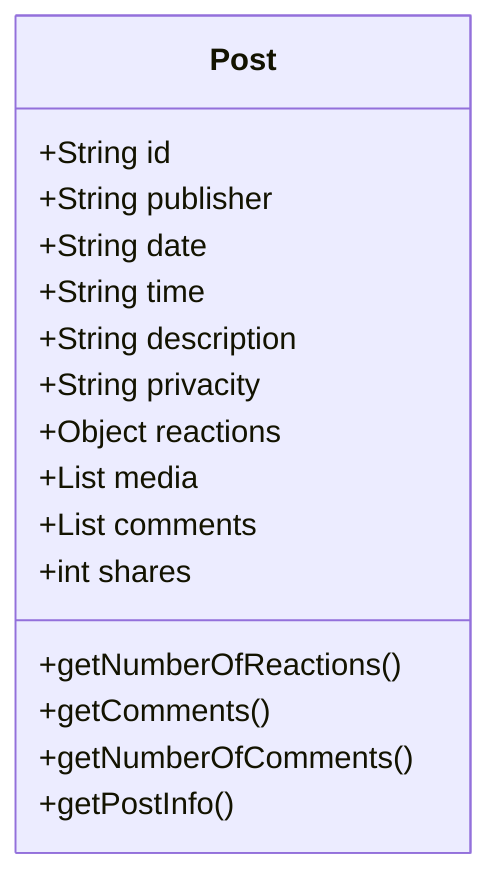

### **Activity 1.3.3.** Modeling a Biography Entity

Modelado del siguiente diagrama de clases de un post de Facebook.

El diagrama es el siguiente:

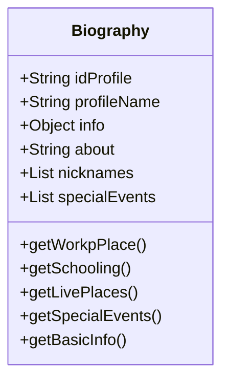

## 1.4 **Uber Objects**

### **Activity 1.4.1.** Modeling a User Profile Entity

Modelado del siguiente diagrama de clases de un pefil de usuario de Uber, siendo este el caso de un conductor.

El diagrama es el siguiente:

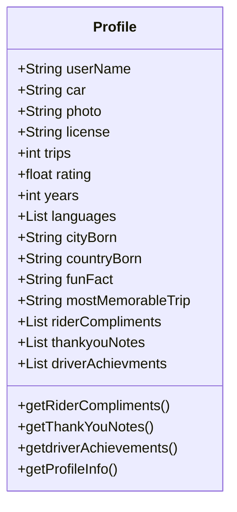

### **Activity 1.4.2.** Modeling a Travel Entity

Modelado del siguiente diagrama de clases de un viaje de usuario de Uber.

El diagrama es el siguiente:

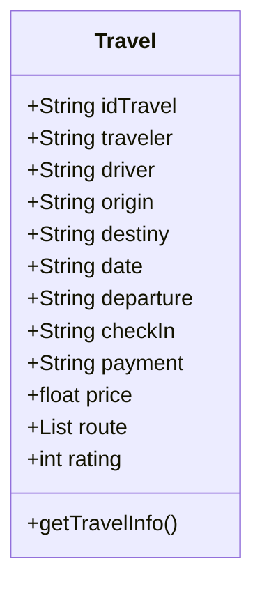