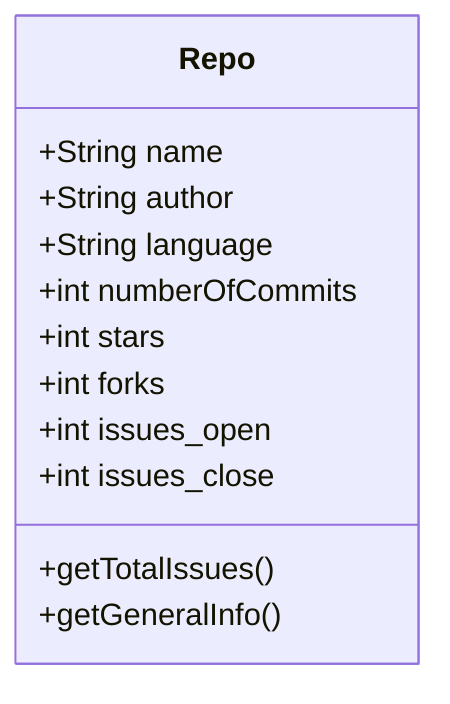
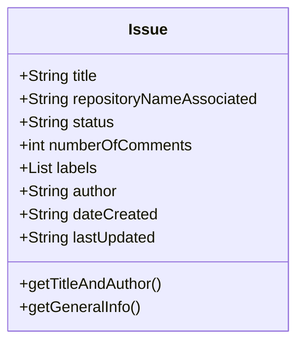

# Week 2 - Excercises

## Excercise 1: Modeling JavaScript Objects

### 1.1. **Github Objects**

### **Activity 1.1.1.** Modeling a Repository Entity

Se modelará el siguiente diagrama de clases de una simulación de un repositorio de GitHub.

El diagrama es el siguiente:

### **Activity 1.1.2.** Modeling a Issue Entity

Se modelará el siguiente diagrama de clases de una Issue de GitHub.

